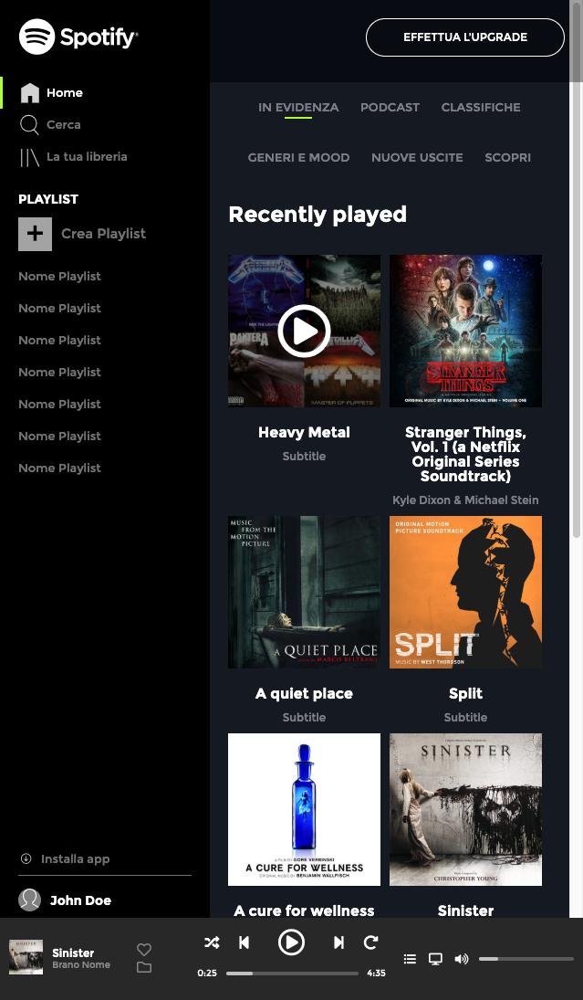

# Spotify

L'obiettivo principale di questo progetto era creare una web app con un layout responsivo che assicurasse che il contenuto della pagina rimanesse all'interno della viewport.

## Font e stile

È stato utilizzato il carattere "Montserrat" per un aspetto pulito e moderno. L'interfaccia utente è stata progettata con cura per offrire un'esperienza coinvolgente e intuitiva agli utenti.

## Layout Responsivo - Breakpoints

Per garantire un'esperienza utente ottimale su diverse dimensioni di schermo, ho sviluppato un layout responsivo basato sui breakpoints di Bootstrap. Questi breakpoints hanno permesso di creare un design che si adatta in modo flessibile sia ai dispositivi desktop che ai dispositivi mobili. Inoltre, ho adottato un approccio "mobile-first", il che significa che il design e la funzionalità sono stati inizialmente concepiti per dispositivi mobili e poi adattati ai desktop.

## Layout di riferimento (xs)

## Layout di riferimento (s)

## Layout di riferimento (md)

## Layout di riferimento (lg)

